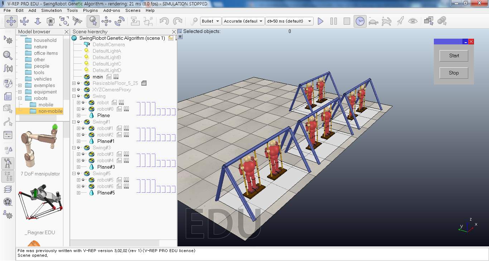
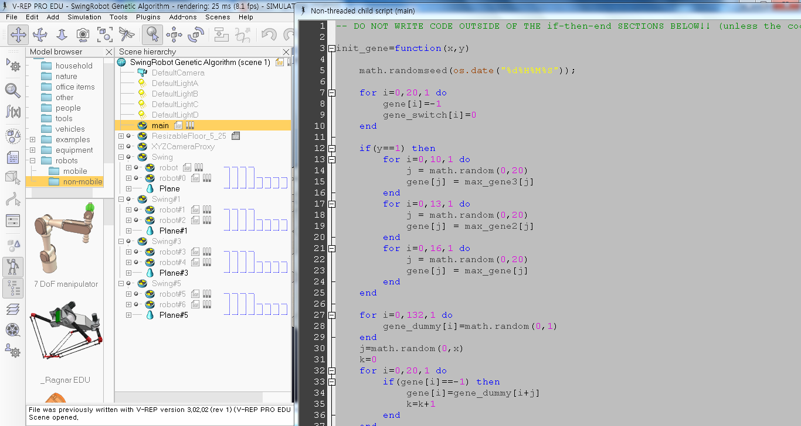
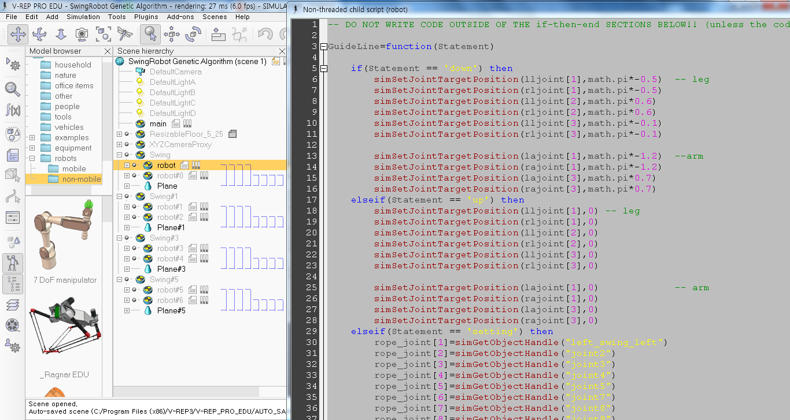
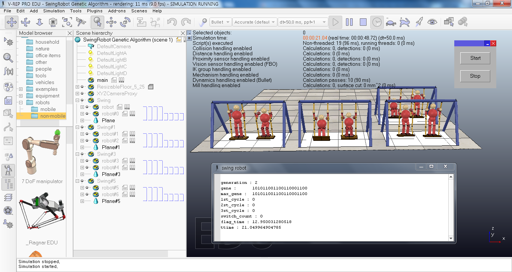

# V-Rep-Genetic-Swing-robot
Swing Robot based on Genetic Algorithm [V-Rep]

V-Rep Genetic Swing robot is a project made by jaekwon Ha.

dummy controller ( script of 'main' ) controll all simulation.
this calculates which robot is highest and selects gene and allocates next gene to each robot.

*demo video
[youtube](https://www.youtube.com/watch?v=fXgcp6ZRCrE)

